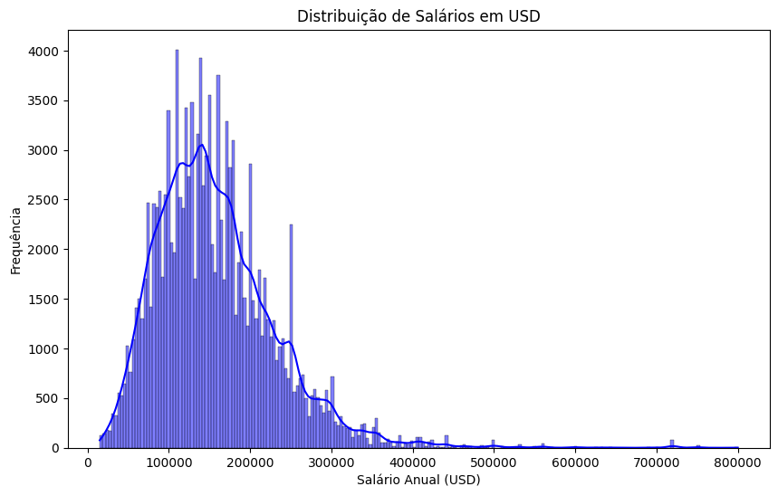
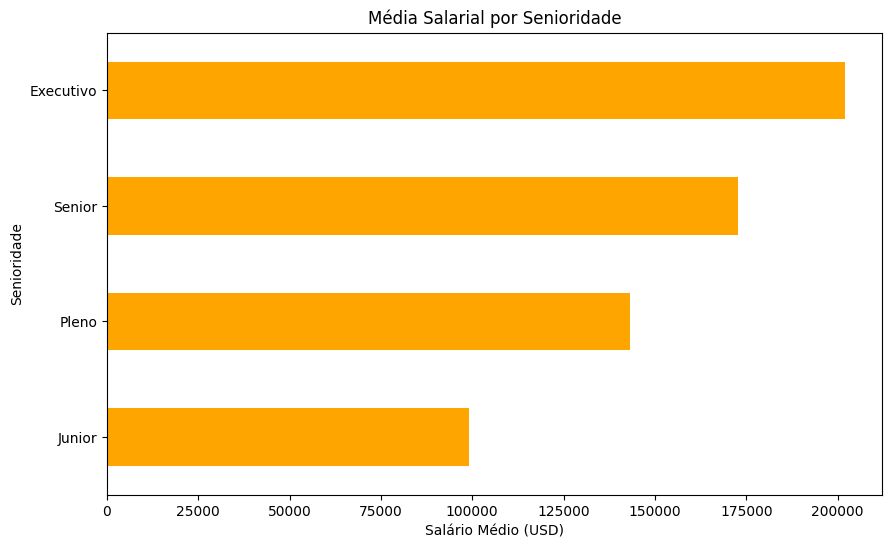
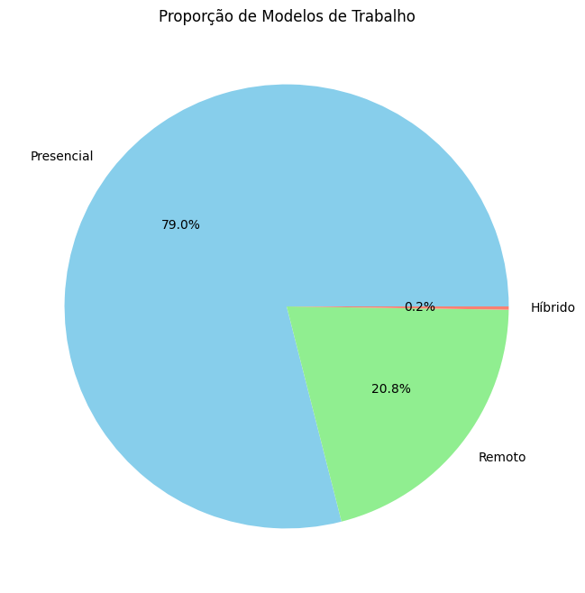

# Dashboard de Análise de Salários - Data Science

## Link do Projeto
Podes aceder ao dashboard interativo em tempo real aqui:

## Visão geral do projeto

Este projeto de Análise Exploratória de Dados (EDA) foi desenvolvido para gerar insights estratégicos sobre as tendências salariais na área de Data Science. O objetivo central é processar uma base de dados de salários globais, identificar padrões de mercado e fornecer inteligência competitiva para profissionais e recrutadores. A análise abrange a limpeza de dados, manipulação de estruturas complexas e visualização interativa de métricas críticas.

## Stack tecnológica

- **Python & Pandas**: Limpeza de dados, tratamento de valores nulos, manipulação de DataFrames e cálculo de métricas de salário (média, máxima, distribuição por senioridade e tipo de contrato).
- **Google Colab**: Ambiente de prototipagem, documentação técnica e reproducibilidade da análise exploratória.
- **Streamlit**: Dashboard interativo com filtros dinâmicos permitindo exploração em tempo real de dados salariais por ano, senioridade, tipo de contrato e tamanho da empresa.
- **Plotly**: Geração de visualizações estatísticas avançadas para data storytelling e comunicação de insights.

## Resultados e recomendação estratégica

A análise verificou métricas críticas incluindo distribuição salarial por cargo, impacto da senioridade na remuneração, efeito do tipo de contrato (FT, CT, PT) e variações geográficas. Os insights principais apontaram para:

- **Disparidades salariais significativas** entre níveis de senioridade (Senior vs. Junior: diferença média de ~$80k USD)
- **Impacto do tipo de contrato** na remuneração, com Full-Time predominando nas ofertas de maior valor
- **Importância crítica da limpeza de dados** - A correção da coluna de senioridade (antes: 'senoridade' com typo) foi essencial para garantir consistência nas análises

O dashboard interativo permite que profissionais filtrem por preferências pessoais (ano, experiência, tipo de contrato, tamanho da empresa) para tomar decisões informadas sobre carreiras e negociações salariais.

### 1. Distribuição de Salários Anuais

O gráfico abaixo demonstra a distribuição de frequência dos salários anuais em USD, revelando a concentração de profissionais em faixas específicas e ajudando a identificar benchmarks de mercado.

  

### 2. Top 10 Cargos por Salário Médio

Aqui, podemos visualizar os cargos com maior remuneração média, destacando oportunidades de carreira com melhor potencial salarial.

  

### 3. Proporção de Modelos de Trabalho (Presencial vs. Remoto)

Este gráfico evidencia a evolução do trabalho remoto na área de dados, um fator cada vez mais importante na tomada de decisão profissional.

  

## Como explorar a análise

1. Clone este repositório.
2. Abra o arquivo `.ipynb` no [Google Colab](https://colab.research.google.com/).
3. Faça o upload do arquivo `dados-imersao-final.csv` no ambiente.
4. Execute as células para acompanhar a linha de raciocínio lógico, transformações de dados e geração de visualizações.
5. Para acessar o **dashboard interativo**, execute o comando: `streamlit run app.py`

## Funcionalidades do Dashboard Streamlit

- ✅ **Filtros Dinâmicos**: Ano, Senioridade, Tipo de Contrato, Tamanho da Empresa
- ✅ **Métricas em Tempo Real**: Salário médio, máximo, total de registros, cargo mais frequente
- ✅ **Visualizações Avançadas**: Gráficos de barras, histogramas, gráficos de pizza e mapas coropletos
- ✅ **Análise Geográfica**: Mapa mundial com salários médios de Cientista de Dados por país
- ✅ **Exportação de Dados**: Tabela detalhada com todos os registros filtrados

## Orientação Técnica
Este projeto foi desenvolvido durante a Imersão Dados da Alura, com o apoio de:
* [Guilherme Lima](https://github.com/guilhermeonrails) — Tech Educator na Alura e Professor na USP.
* [Valquíria Alencar](https://www.linkedin.com/in/valquiria-alencar/) — Senior Data/AI Analyst no Insper.
* [Vinicius Caridá](https://www.linkedin.com/in/viniciuscarida/) — Especialista em Dados no Itaú.

  
---
> *Transparência e Vibe Coding: Este projeto utilizou otimização com IA para estruturação e documentação. No entanto, toda a análise técnica, tomada de decisão sobre estratégia de limpeza de dados, seleção de visualizações e interpretação dos insights são de minha autoria sob orientação das aulas da imersão. A IA foi uma ferramenta complementar para acelerar processos, mantendo total controle sobre a qualidade e direcionamento estratégico do projeto.*
